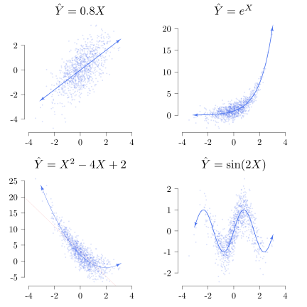
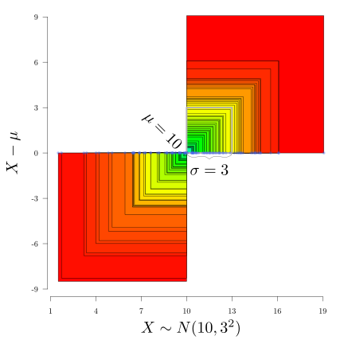
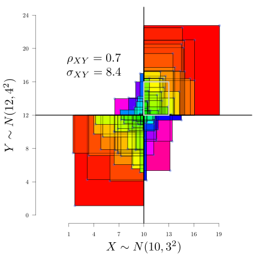

```{r, include=FALSE}
knitr::opts_chunk$set(dev="svg", fig.width=10, fig.height = 7.5,tidy=TRUE,tidy.opts=list(blank=FALSE, width.cutoff=40), echo=FALSE, family="serif")

library(mvtnorm)
library(psych)
library(tikzDevice)
library(shape)

CurlyBraces <- function(x, y, range, pos = 1, direction = 1,... ) {
  
  a=c(1,2,3,48,50)    # set flexion point for spline
  b=c(0,.2,.28,.7,.8) # set depth for spline flexion point
  
  curve = spline(a, b, n = 50, method = "natural")$y / 2 
  
  curve = c(curve,rev(curve))
  
  a_sequence = rep(x,100)
  b_sequence = seq(y-range/2,y+range/2,length=100)  
  
  # direction
  if(direction==1)
    a_sequence = a_sequence+curve
  if(direction==2)
    a_sequence = a_sequence-curve
  
  # pos
  if(pos==1)
    lines(a_sequence,b_sequence,...) # vertical
  if(pos==2)
    lines(b_sequence,a_sequence,...) # horizontal
  
}

rb2a <- rgb(67/255, 100/255, 238/255, 0.3) 
fb2a <- rgb(238/255, 44/255, 44/255, 0.2) 
set.seed(201)
"%+%" <- function(...){
  paste0(...,sep="")
}

ArrHead <- function(x,y,ends=3,...){
  require(shape)
  k <- length(x)
  if(ends!=2) Arrows(x[1],y[1],x[2],y[2],code = 1,...)
  if(ends!=1) Arrows(x[k-1],y[k-1],x[k],y[k],code = ,...)
}

```

# Setup

To compile this presententation using RStudio, save the [markdown document](http://my.ilstu.edu/~wjschne/442/MatrixAlgebraInR.Rmd) and the [slidy.css](http://my.ilstu.edu/~wjschne/442/slidy.css) file into the same folder and then make that folder your working directory. Click *Knit HTML*.

# Relationships

There is an infinite variety of ways in which two variables can be related. The **correlation coefficient** measures just one way, *linear relationships*. If two variables have a *non-linear relationship*, the correlation coefficient will measure the degree to which there is a linear trend. In some cases, this results in only minor distortion whereas in others, complete obfuscation.

```{r,echo=FALSE,message=FALSE,eval=FALSE}
set.seed(21)

f <- "VariableRelationships"
tikz(f %+% ".tex",standAlone=TRUE,width=6,height=6)

par(pch=16,bty="n",pty="s",mfcol=c(2,2),mar=c(3,1,3,0),las=1,family="serif",cex.main=2,cex.lab=2,cex.axis=1.5)
n <- 1000
x <- rnorm(n)
e <- rnorm(n)
linear <- function(x) 0.8*x
y1 <- linear(x) + e 
plot(x,y1,col=rb2a,cex=0.5,xlim = c(-4,4),main="$\\hat{Y}=0.8X$",xlab="",ylab="")
f1 <- curve(linear,from=-3,to=3,add=TRUE,col="royalblue2",lwd=2)
ArrHead(f1$x,f1$y,col="royalblue2",arr.length=0.2)


quadratic <- function(x) x^2 -4*x + 2
y2 <- quadratic(x) + 2*e
plot(x,y2,col=rb2a,cex=0.5,xlim = c(-4,4),main="$\\hat{Y}=X^2-4X+2$",lwd=2,xlab="",ylab="")
f2 <- curve(quadratic,from=-3,to=3,add=TRUE,col="royalblue2")
ArrHead(f2$x,f2$y,col="royalblue2",arr.length=0.2)
abline(lm(y2~x),col=fb2a)

y3 <- exp(x)+e
plot(x,y3,col=rb2a,cex=0.5,xlim = c(-4,4),main="$\\hat{Y}=e^X$",lwd=2,xlab="",ylab="")
f3 <- curve(exp,from=-3,to=3,add=TRUE,col="royalblue2",lwd=2)
ArrHead(f3$x,f3$y,col="royalblue2",xpd=TRUE,arr.length=0.2)

sinf <- function(x) sin(x*2)
y4 <- sinf(x) + 0.5*e
plot(x,y4,col=rb2a,cex=0.5,xlim = c(-4,4),main="$\\hat{Y}=\\sin (2X)$",lwd=2,xlab="",ylab="")
f4 <- curve(sinf,from=-3,to=3,add=TRUE,col="royalblue2",lwd=2)
ArrHead(f4$x,f4$y,col="royalblue2",arr.length=0.2)

dev.off()
tools::texi2dvi(f %+% ".tex",pdf=TRUE,clean = TRUE)

# Using pdf2svg (http://www.cityinthesky.co.uk/opensource/pdf2svg/) 
shell("pdf2svg " %+% f %+% ".pdf " %+% f %+% ".svg")
file.remove(f %+% ".pdf")
file.remove(f %+% ".tex")
pander::openFileInOS(f %+% ".svg")
```



Fortunately, with a bit of tweaking we can get the correlation coefficient to measure almost any kind of relationship but that is beyond the scope of this presentation.

# Variance

**Variance** is a measure of variability. It is not the averate deviation from the mean, but the average *squared* deviation from the mean:

$$\sigma_X=E\left((X-\mu)^2\right)$$

In the figure below, the variable has a mean of 10 and a standard deviation of 3. Each square represents a squared deviation from the mean. The gray square has a length of 3. The area of the gray square is 9, the variance.

```{r,eval=F,echo=F}

f <- "VarianceRectangles"
tikz(f %+% ".tex",standAlone=TRUE,width=6,height=6)
par(family="serif",bty="n",las=1,mar=c(5,5,1,1))
mu <- 10
sigma <- 3
plot(d1,rep(0,n),type="n",col=rb2a,las=1,xlab="$X \\sim N(10,3^2)$",ylab=paste0("$X-\\mu$"),pch=16,cex=1,ylim=c(-6,6),asp=1,axes=FALSE,cex.lab=2,cex.axis=1.5)
axis(1,at=seq(1,19,3))
axis(2,at=seq(-9,9,3),las=1)
ov<-order(d1^2)
od1<-d1[ov]

rect(mu,0,od1[1:50],od1[1:50]-mu,col=rainbow(100,end=0.9))
rect(mu,0,od1[seq(100,51)],od1[seq(100,51)]-mu,col=rainbow(100,end=0.9))
rect(mu,0,mu+sigma,sigma,lwd=5,border="gray70")
points(d1,rep(0,n),pch=16,cex=0.8,col=rb2a)

text(mu,0,paste0("$\\mu=",round(mu,1),"$"),srt=-45,adj = c(1.2,0.5),cex=2)
text(mu+sigma/2,0,paste0("$\\sigma=",round(sigma,2),"$"),adj=c(0.5,2),cex=2)
CurlyBraces(y = mu+sigma/2,x=0,sigma,direction = 2,pos = 2,col="gray40")
dev.off()
tools::texi2dvi(f %+% ".tex",pdf=TRUE,clean = TRUE)

# Using pdf2svg (http://www.cityinthesky.co.uk/opensource/pdf2svg/) 
shell("pdf2svg " %+% f %+% ".pdf " %+% f %+% ".svg")
file.remove(f %+% ".pdf")
file.remove(f %+% ".tex")
pander::openFileInOS(f %+% ".svg")
```



# Covariance

**Covariance** is an unstandardized measure of the strength of linear relationships. Because it is unstandardized, its meaning depends on the scale of the variables being measured.

The covariance between two variables is the average product of their deviations from their respective means:

$$\sigma_{XY}=E\left((X-\mu_X)(Y-\mu_Y)\right)$$

In the plot below, the deviations from the means of *X* and *Y* are represented by colored rectangles. The covariance is equal to the area of the gray rectangle, which is the average size of all the rectanges. Note that the blue and violet rectangles have negative area.

```{r,eval=F,echo=F}
set.seed(201)
mu <- 10
sigma <- 3
rho=0.7
muy <- 12
sigmay <- 4
d<-rmvnorm(n=n,mean=c(mu,muy),sigma=matrix(c(sigma^2,rho*sigma*sigmay,rho*sigma*sigmay,sigmay^2),nrow=2))
f <- "CovarianceRectangles"
tikz(f %+% ".tex",standAlone=TRUE,width=6,height=6)
par(family="serif",bty="n",las=1,mar=c(5,5,1,1))
n<-100

colnames(d)<-c("$X$","$Y$")
plot(d,type="n",xlab=paste0("$X \\sim N(",mu,",",sigma,"^2)$"),ylab=paste0("$Y \\sim N(",muy,",",sigmay,"^2)$"),pch=16,cex=1, xlim=c(mu-3*sigma,mu+3*sigma),ylim=c(muy-3*sigmay,muy+3*sigmay),axes=F,asp=1,cex.lab=2,cex.axis=1.5)
axis(1,at=seq(mu-sigma*3,mu+sigma*3,sigma))
axis(2,at=seq(muy-3*sigmay,muy+3*sigmay,sigmay))
text(mu-2*sigma,muy+1.5*sigmay,paste0("$\\sigma_{XY}=",round(sigma*sigmay*rho,2),"$"),pos=1,cex=2)
text(mu-2*sigma,muy+1.5*sigmay,paste0("$\\rho_{XY}=",round(rho,2),"$"),pos=3, cex=2)

# ellipses(d,smooth =FALSE,col="#0000FFA0",add=TRUE,n=2)
cp<-(d[,1]-mu)*(d[,2]-muy)
d1<-d[,1]
d2<-d[,2]
o<-order(-cp)
od<-cbind(d1[o],d2[o],cp[o])
rect(mu, muy, od[1:79,1], od[1:79,2], col=rainbow(79,end=0.4))
o<-order(cp)
od<-cbind(d1[o],d2[o],cp[o])
crain<-rainbow(21,start = 0.4,end=0.9)
orain<-22-seq(1,21)
rect(mu, muy, od[1:21,1], od[1:21,2], col=crain[orain])
abline(v=mu, lwd=3)
abline(h=muy, lwd=3)
points(d,pch=16,cex=1,col=rb2a)
rect(mu, muy, d1, d2)
rect(mu, muy,mu+sigma,muy+sigmay,lwd=5,border="gray80")
dev.off()
tools::texi2dvi(f %+% ".tex",pdf=TRUE,clean = TRUE)

# Using pdf2svg (http://www.cityinthesky.co.uk/opensource/pdf2svg/) 
shell("pdf2svg " %+% f %+% ".pdf " %+% f %+% ".svg")
file.remove(f %+% ".pdf")
file.remove(f %+% ".tex")
# pander::openFileInOS(f %+% ".svg")

```



Note that the covariance of *X* with itself is its variance:

$$\begin{aligned}\sigma_{XX}&=E\left((X-\mu_X)(X-\mu_X)\right)\\
&=E\left((X-\mu_X)^2\right)\\
&=\sigma_X^2\end{aligned}$$


# Covariance

$$\begin{aligned}\sigma_{XY}&=E\left((X-\mu_X)(Y-\mu_Y)\right)\\
&=E\left(XY-X\mu_Y-\mu_X Y +\mu_X\mu_Y\right)\\
&=E\left(XY\right)-E\left(X\mu_Y\right)-E\left(\mu_X Y\right)+E\left(\mu_X\mu_Y\right)\\
&=E\left(XY\right)-E\left(X\right)\mu_Y-\mu_X E\left(Y\right)+\mu_X\mu_Y\\
&=E\left(XY\right)-\mu_X\mu_Y-\mu_X\mu_Y+\mu_X\mu_Y\\
&=E\left(XY\right)-\mu_X\mu_Y\\
\end{aligned}$$

Covariance is the mean product minus the product of the means.

# Many kinds of averages

## Arithmetic mean

$$\frac{\sigma_X^2+\sigma_Y^2}{2}$$

## Geometric mean

$$\sqrt{\sigma_X^2\sigma_Y^2}$$

In general, the geometric mean:

$$\left(\prod_{i=1}^nx_i \right)^{1/n} =  \sqrt[n]{x_1 x_2...x_n}$$

The advantage of the geometric mean is that variables with very different metrics can be averaged without one variable dominating the mean.

